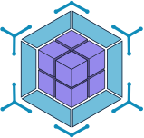

<div align="center">
  

  <h1>React Module Federation Demo</h1>
  <p>React 18 ile Module Federation 2.0'ın minimal demosu — host + remote pattern.</p>

  <a href="./README.md">🇬🇧 English</a> · 🇹🇷 Türkçe
</div>

---

## Genel Bakış

Bu proje, iki bağımsız React uygulamasıyla Module Federation 2.0'ı göstermektedir:

| Uygulama | Rol | Port |
|---|---|---|
| `shell-app` | Host — remote modülleri tüketir | 3000 |
| `products-app` | Remote — `ProductList` bileşenini açar | 3001 |

## Proje Yapısı

```
react-module-federation-demo/
├── shell-app/        # Host uygulama (port 3000)
├── products-app/     # Remote uygulama (port 3001)
├── docker-compose.yml
└── package.json
```

## Ön Koşullar

- Node.js 18+
- npm 9+
- Docker & Docker Compose (opsiyonel, container ile çalıştırmak için)

## Kurulum

```bash
npm run install:all
```

## Geliştirme

**Her iki uygulamayı birlikte başlat:**
```bash
npm start
```

**Ayrı ayrı çalıştır:**
```bash
npm run start:shell      # http://localhost:3000
npm run start:products   # http://localhost:3001
```

## Production (Docker)

```bash
npm run docker:build
npm run docker:up
```

Tarayıcıda `http://localhost:3000` adresini aç.

**Durdur:**
```bash
npm run docker:down
```

## Testler

```bash
npm test --prefix shell-app
npm test --prefix products-app
```

## Makale

📖 [Makaleyi oku](ARTICLE_URL)

---

Bu README [markdown-manager](https://github.com/yasinatesim/markdown-manager) tarafından oluşturulmuştur 🥲
